# Architecture Overview

This document provides a comprehensive overview of the Vulnerable Node application architecture, design patterns, and component interactions.

## Table of Contents

- [Application Stack](#application-stack)
- [Architecture Diagram](#architecture-diagram)
- [Layer Architecture](#layer-architecture)
- [Component Interactions](#component-interactions)
- [Data Flow](#data-flow)
- [Session Management](#session-management)
- [Database Design](#database-design)
- [Deployment Architecture](#deployment-architecture)

## Application Stack

### Technology Stack

| Layer | Technology | Version | Purpose |
|-------|-----------|---------|---------|
| **Runtime** | Node.js | 12.x+ | JavaScript runtime environment |
| **Framework** | Express.js | 4.13.1 | Web application framework |
| **Template Engine** | EJS | 2.4.2 | Server-side rendering |
| **Database** | PostgreSQL | 9.x+ | Relational database |
| **ORM/Query** | pg-promise | 4.4.6 | PostgreSQL client library |
| **Session** | express-session | 1.13.0 | Session middleware |
| **Logging** | log4js | 0.6.36 | Application logging |
| **HTTP Logging** | morgan | 1.6.1 | HTTP request logging |

### Dependencies

```json
{
  "dependencies": {
    "body-parser": "~1.13.2",
    "cookie-parser": "~1.3.5",
    "debug": "~2.2.0",
    "ejs": "^2.4.2",
    "ejs-locals": "^1.0.2",
    "express": "~4.13.1",
    "express-session": "^1.13.0",
    "log4js": "^0.6.36",
    "morgan": "~1.6.1",
    "pg-promise": "^4.4.6",
    "serve-favicon": "~2.3.0"
  }
}
```

## Architecture Diagram

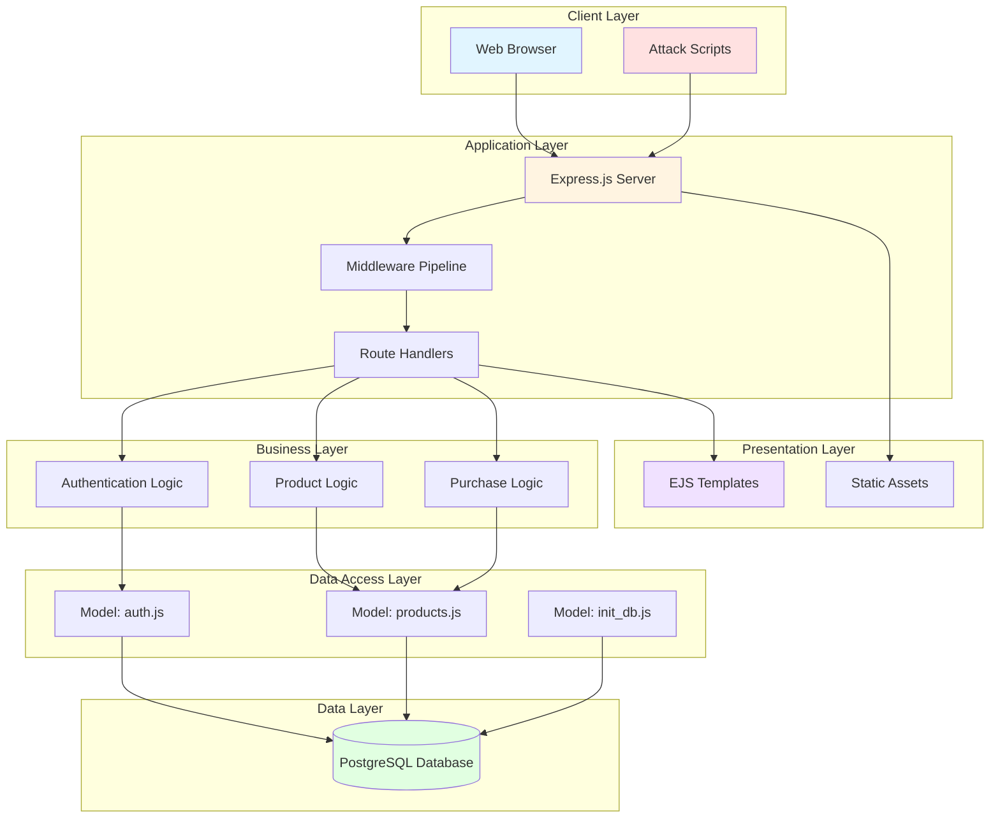

## Layer Architecture

### 1. Presentation Layer

**Responsibility:** User interface and client-side logic

**Components:**
- **EJS Templates** (`views/`) - Server-side rendered HTML
- **Static Assets** (`public/`) - CSS, JavaScript, images

**Key Files:**
```
views/
├── login.ejs           # Login form
├── products.ejs        # Product catalog
├── product_detail.ejs  # Single product view
├── search.ejs          # Search results
├── bought_products.ejs # Purchase history
└── error.ejs           # Error page
```

---

### 2. Application Layer

**Responsibility:** HTTP request handling and routing

**Components:**
- **Express Server** (`app.js`) - Main application setup
- **Route Handlers** (`routes/`) - URL endpoint definitions
- **Middleware Pipeline** - Request processing chain

**Middleware Stack:**

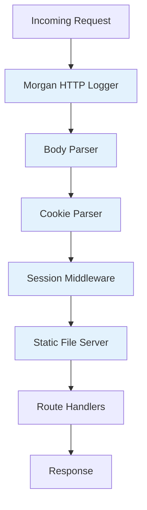

---

### 3. Business Logic Layer

**Responsibility:** Application-specific logic and workflows

**Components:**
- **Authentication Flow** - Login/logout handling
- **Product Catalog** - Browse and search products
- **Purchase Processing** - Order handling
- **Session Validation** - Access control

---

### 4. Data Access Layer

**Responsibility:** Database operations and queries

**Components:**
- **auth.js** - User authentication queries
- **products.js** - Product CRUD operations
- **init_db.js** - Database initialization

**Pattern:** Direct SQL queries (no ORM abstraction)

---

### 5. Data Layer

**Responsibility:** Data persistence

**Components:**
- **PostgreSQL Database** - Relational storage
- **Three Tables:** users, products, purchases

## Component Interactions

### Authentication Flow

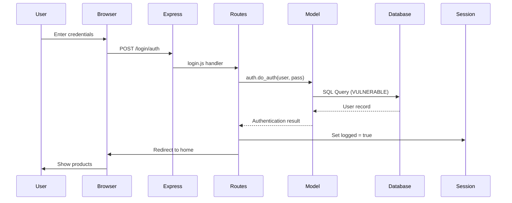

### Product Purchase Flow

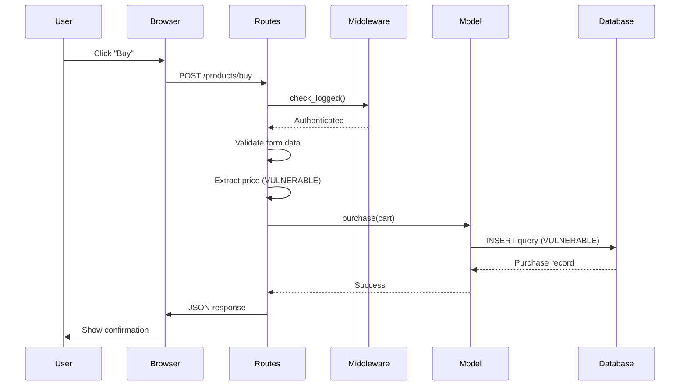

### Search Flow

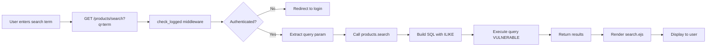

## Data Flow

### Request Processing Pipeline

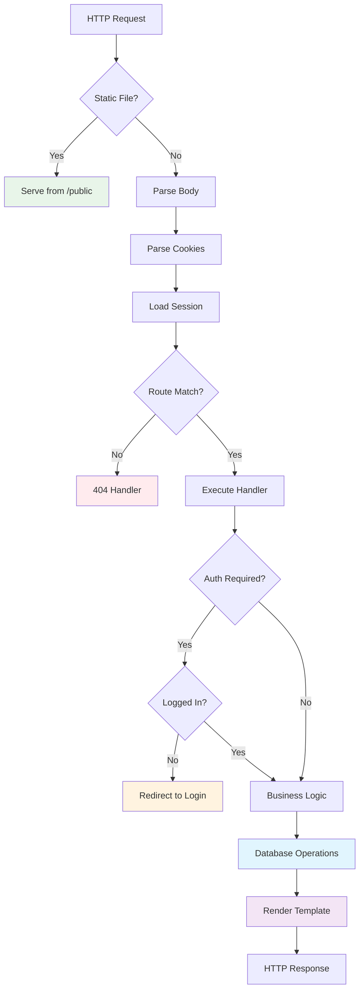

## Session Management

### Session Architecture

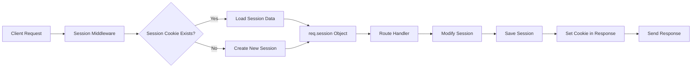

### Session Data Structure

```javascript
req.session = {
    logged: true,           // Authentication state
    user_name: "admin",     // Current username
    cookie: {
        secure: false,      // VULNERABLE: Not HTTPS-only
        maxAge: 99999999999 // VULNERABLE: Excessive lifetime
    }
}
```

## Database Design

### Entity Relationship Diagram

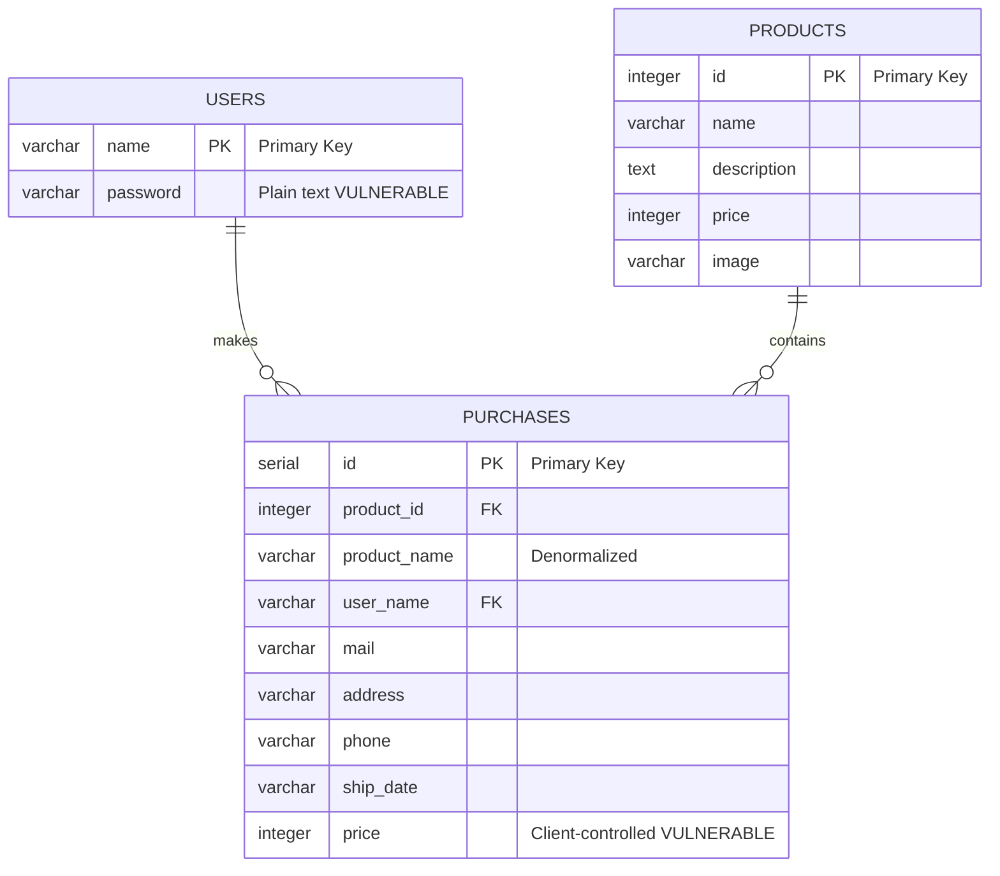

### Database Access Patterns

**Connection Strategy:**

```javascript
// auth.js - New connection per request
function do_auth(username, password) {
    var db = pgp(config.db.connectionString);  // New connection
    // ... use db
}

// products.js - Persistent connection
var db = pgp(config.db.connectionString);  // Module-level connection
// ... reuse db across functions
```

## Deployment Architecture

### Docker Compose Deployment

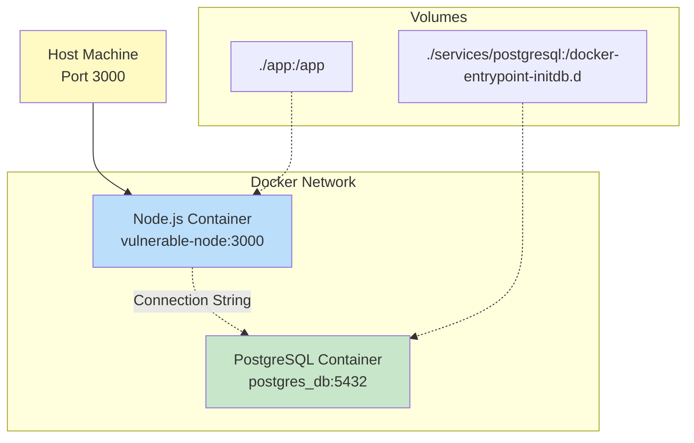

### Container Configuration

**Application Container:**
```dockerfile
FROM node:12
WORKDIR /app
COPY package.json .
RUN npm install
COPY . .
EXPOSE 3000
CMD ["npm", "start"]
```

**Database Container:**
```yaml
postgres_db:
  image: postgres
  environment:
    POSTGRES_PASSWORD: postgres
    POSTGRES_DB: vulnerablenode
  ports:
    - "5432:5432"
```

### Environment Configurations

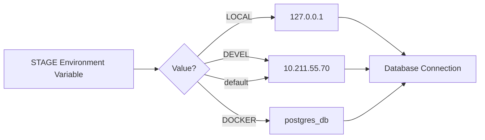

## Performance Considerations

### Bottlenecks

1. **Database Queries** - No connection pooling optimization
2. **Session Storage** - In-memory (not distributed)
3. **No Caching** - Every request hits database
4. **ReDoS Vulnerability** - Can cause CPU exhaustion

### Scalability Limitations

- **Single Process** - No clustering or load balancing
- **Session Affinity** - Sessions not shared across instances
- **No Read Replicas** - All queries hit primary database
- **Synchronous Processing** - Blocking I/O operations

> [!NOTE]
> Performance optimization is not a priority for this intentionally vulnerable demonstration application.

## Security Architecture

### Attack Surface

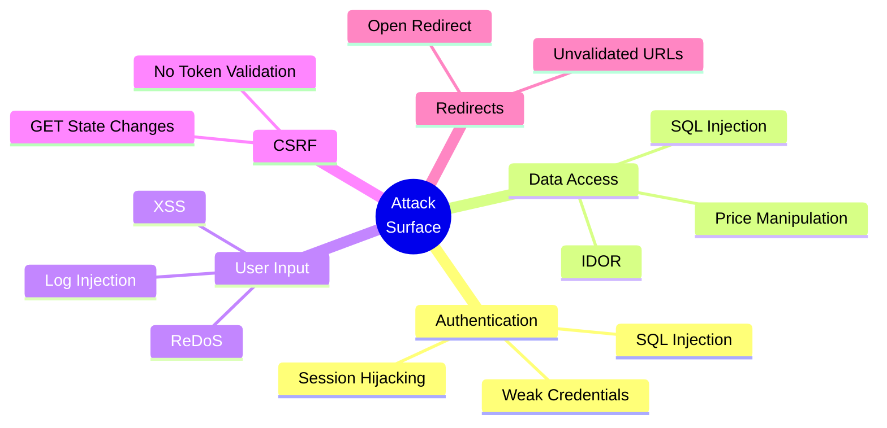

### Security Controls

| Control Type | Implementation | Effectiveness |
|--------------|----------------|---------------|
| Input Validation | ❌ None | N/A |
| Output Encoding | ⚠️ Partial (EJS auto-escape) | Limited |
| Authentication | ❌ Vulnerable | None |
| Authorization | ⚠️ Session-based only | Weak |
| CSRF Protection | ❌ None | N/A |
| SQL Injection Protection | ❌ None | N/A |
| XSS Protection | ⚠️ Template engine only | Limited |

## Related Documentation

- [SECURITY.md](./SECURITY.md) - Detailed vulnerability documentation
- [README.md](./README.md) - Project overview and setup
- [routes/README.md](./routes/README.md) - Route handler details
- [model/README.md](./model/README.md) - Data access layer details

---

> [!IMPORTANT]
> This architecture is intentionally insecure for educational purposes. Do not use as a reference for production systems.
