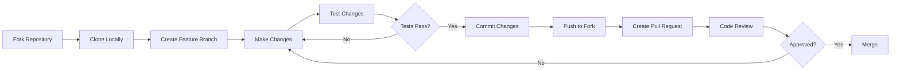

# Contributing to Vulnerable Node

Thank you for your interest in contributing to Vulnerable Node! This document provides guidelines and instructions for contributing to the project.

## Table of Contents

- [Code of Conduct](#code-of-conduct)
- [How Can I Contribute?](#how-can-i-contribute)
- [Development Setup](#development-setup)
- [Contribution Guidelines](#contribution-guidelines)
- [Adding New Vulnerabilities](#adding-new-vulnerabilities)
- [Documentation Standards](#documentation-standards)
- [Testing](#testing)
- [Pull Request Process](#pull-request-process)

## Code of Conduct

This project follows a code of conduct to ensure a welcoming environment for all contributors:

- **Be respectful** - Treat everyone with respect and consideration
- **Be collaborative** - Work together constructively
- **Be inclusive** - Welcome newcomers and diverse perspectives
- **Stay on topic** - Keep discussions relevant to the project
- **Report issues** - Contact maintainers if you observe inappropriate behavior

## How Can I Contribute?

### Reporting Bugs

> [!NOTE]
> This project contains intentional vulnerabilities. Only report actual bugs in the infrastructure or documentation.

**Before submitting a bug report:**
- Check if it's an intentional vulnerability (see [SECURITY.md](./SECURITY.md))
- Search existing issues to avoid duplicates
- Collect relevant information (Node.js version, OS, error messages)

**Submitting a bug report:**
1. Use the GitHub issue tracker
2. Provide a clear, descriptive title
3. Include steps to reproduce
4. Include actual vs. expected behavior
5. Add relevant logs or screenshots

### Suggesting Enhancements

Enhancement suggestions are welcome for:
- New vulnerability examples
- Improved documentation
- Better attack demonstrations
- Additional OWASP Top 10 coverage
- Enhanced educational value

**Submitting enhancement suggestions:**
1. Check if the suggestion already exists in issues
2. Clearly describe the enhancement
3. Explain why it would be valuable
4. Include examples or mockups if applicable

### Your First Code Contribution

New to the project? Here are good first contributions:

- **Documentation improvements** - Fix typos, clarify explanations
- **Attack examples** - Add exploitation demonstrations
- **Code comments** - Enhance inline documentation
- **Test cases** - Add validation for vulnerabilities
- **Docker improvements** - Enhance deployment

## Development Setup

### Prerequisites

- Node.js 12.x or higher
- PostgreSQL 9.x or higher
- Git
- Docker and Docker Compose (optional)

### Local Setup

1. **Fork and clone the repository:**
```bash
git clone https://github.com/YOUR_USERNAME/vulnerable-node.git
cd vulnerable-node
```

2. **Install dependencies:**
```bash
npm install
```

3. **Start PostgreSQL:**
```bash
# Using Docker
docker-compose up -d postgres_db

# Or manually
createdb vulnerablenode
```

4. **Configure environment:**
```bash
export STAGE=LOCAL
```

5. **Start the application:**
```bash
npm start
```

6. **Verify setup:**
```bash
curl http://localhost:3000/login
```

### Development Workflow



## Contribution Guidelines

### Code Style

- **JavaScript:** Follow existing code style
- **Indentation:** 4 spaces (not tabs)
- **Line length:** Maximum 120 characters
- **Comments:** Document intentional vulnerabilities clearly
- **Naming:** Use descriptive variable and function names

### Commit Messages

Use clear, descriptive commit messages:

**Good examples:**
```
Add SQL injection example for product search
Document XSS vulnerability in login error handler
Improve README installation instructions
```

**Bad examples:**
```
Fix bug
Update code
Changes
```

### Branch Naming

Use descriptive branch names:

- `feature/add-nosql-injection` - New features
- `docs/improve-architecture` - Documentation
- `attack/csrf-example` - Attack demonstrations
- `fix/docker-compose-issue` - Bug fixes

## Adding New Vulnerabilities

### Vulnerability Requirements

When adding new vulnerabilities:

1. **Choose appropriate vulnerabilities** - Focus on OWASP Top 10
2. **Real, not simulated** - Actual exploitable code
3. **Document thoroughly** - Inline comments and security docs
4. **Provide exploitation** - Include attack examples
5. **Maintain context** - Fit within e-commerce scenario

### Vulnerability Documentation Template

```javascript
/**
 * [Function Name]
 * 
 * [Brief description of functionality]
 * 
 * @param {type} paramName - Parameter description
 * @returns {type} - Return value description
 * 
 * VULNERABILITY: [Vulnerability Type] (OWASP [Category])
 * [Detailed explanation of the vulnerability]
 * 
 * Example attack: [Simple exploitation example]
 */
function vulnerableFunction(userInput) {
    // VULNERABLE: [Brief explanation]
    var query = "SELECT * FROM table WHERE field = '" + userInput + "'";
    return db.query(query);
}
```

### Adding Attack Examples

Place attack scripts in `attacks/` directory:

```
attacks/
├── new-vulnerability/
│   ├── README.md           # Exploitation guide
│   ├── exploit.sh          # Automated exploit
│   └── payload.txt         # Attack payloads
```

## Documentation Standards

All documentation must follow these standards:

### Frontmatter

Every markdown file must include:

```yaml
---
author: [Your Name]
description: [Brief description]
last_changed: YYYY-MM-DD
---
```

### Structure

- **Single H1** - Only one `#` heading per document (title)
- **Sequential headings** - Don't skip levels (H1 → H2 → H3)
- **Table of contents** - Include if 3+ major sections
- **Empty lines** - After headings and before content blocks

### Content Guidelines

- **Be concise** - Clear and to the point
- **Use examples** - Code snippets and demonstrations
- **Add diagrams** - Mermaid diagrams for visualizations
- **GitHub alerts** - Use for important notes

```markdown
> [!NOTE]
> Supplementary information

> [!WARNING]
> Important warning

> [!CAUTION]
> Dangerous operations
```

### Code Blocks

Always specify language for syntax highlighting:

````markdown
```javascript
// JavaScript code
```

```bash
# Bash commands
```
````

## Testing

### Manual Testing

Before submitting:

1. **Start the application:**
```bash
npm start
```

2. **Test basic functionality:**
```bash
# Login
curl -X POST http://localhost:3000/login/auth -d "username=admin&password=admin"

# Browse products
curl http://localhost:3000/

# Search
curl "http://localhost:3000/products/search?q=phone"
```

3. **Verify vulnerabilities work:**
```bash
# Test SQL injection
curl -X POST http://localhost:3000/login/auth -d "username=admin'--&password=anything"
```

### Attack Testing

Test all attack examples:

```bash
cd attacks/
./your-new-attack.sh
```

## Pull Request Process

### Before Submitting

- [ ] Code follows project style guidelines
- [ ] Vulnerabilities are documented with inline comments
- [ ] Documentation updated (README, SECURITY.md, etc.)
- [ ] Attack examples provided and tested
- [ ] Manual testing completed
- [ ] Commit messages are clear and descriptive

### Submitting Pull Request

1. **Push to your fork:**
```bash
git push origin feature/your-feature-name
```

2. **Create pull request on GitHub**

3. **Fill out PR template:**
   - Describe changes made
   - Reference related issues
   - List testing performed
   - Include screenshots if applicable

4. **Wait for review:**
   - Respond to feedback
   - Make requested changes
   - Update documentation as needed

### Review Process

Pull requests will be reviewed for:

- **Code quality** - Follows project standards
- **Documentation** - Clear and complete
- **Vulnerability authenticity** - Real, not simulated
- **Educational value** - Helps security learning
- **Testing** - Works as described

## Recognition

Contributors will be recognized:

- Listed in project contributors
- Credited in documentation
- Mentioned in release notes (for significant contributions)

## Questions?

- **GitHub Issues** - For bugs and feature requests
- **Discussions** - For questions and general discussion
- **Email** - Contact maintainers for private inquiries

## License

By contributing, you agree that your contributions will be licensed under the same BSD license that covers the project.

---

Thank you for contributing to Vulnerable Node! Your efforts help improve security education and testing tools for everyone.
