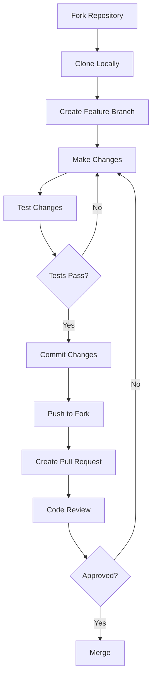

# Contributing to Vulnerable Node

## Table of Contents

- [Introduction](#introduction)
- [Code of Conduct](#code-of-conduct)
- [Getting Started](#getting-started)
- [Development Setup](#development-setup)
- [How to Contribute](#how-to-contribute)
- [Pull Request Process](#pull-request-process)
- [Code Style Guidelines](#code-style-guidelines)
- [Adding New Vulnerabilities](#adding-new-vulnerabilities)
- [Documentation Guidelines](#documentation-guidelines)
- [Issue Reporting](#issue-reporting)

## Introduction

Thank you for your interest in contributing to the vulnerable-node project! This project serves as an educational tool for security researchers, penetration testers, and developers learning about web application security.

> [!NOTE]
> This is an intentionally vulnerable application. Contributions should maintain or add educational security vulnerabilities, not fix them.

## Code of Conduct

By participating in this project, you agree to:

- Be respectful and inclusive in all interactions
- Use the project only for educational purposes
- Not use vulnerabilities demonstrated here against unauthorized systems
- Help maintain a welcoming environment for learners at all levels

## Getting Started

### Prerequisites

Before contributing, ensure you have:

- Git installed on your system
- Docker and Docker Compose installed
- Node.js 19.x or compatible version
- A code editor (VS Code recommended)
- Basic understanding of Node.js and Express.js

### Fork and Clone

1. Fork the repository on GitHub
2. Clone your fork locally:

```bash
git clone https://github.com/YOUR-USERNAME/vulnerable-node.git
cd vulnerable-node
```

3. Add the upstream remote:

```bash
git remote add upstream https://github.com/cr0hn/vulnerable-node.git
```

## Development Setup

### Using Docker (Recommended)

```bash
# Build and start the application
docker-compose build
docker-compose up

# Access at http://127.0.0.1:3000
```

### Local Development

1. Install PostgreSQL and create the database:

```bash
createdb vulnerablenode
```

2. Install dependencies:

```bash
npm install
```

3. Set environment variable:

```bash
export STAGE=LOCAL
```

4. Start the application:

```bash
npm start
```

### Development Workflow



## How to Contribute

### Types of Contributions

We welcome the following contributions:

| Type | Description |
|------|-------------|
| New Vulnerabilities | Add new intentional security flaws |
| Attack Examples | Scripts demonstrating exploitation |
| Documentation | Improve or expand documentation |
| Bug Fixes | Fix bugs that prevent the app from running |
| Tests | Add tests to verify vulnerability behavior |

### Areas Needing Contribution

- [ ] Add vulnerabilities for OWASP Top 10 2021
- [ ] Create automated vulnerability verification tests
- [ ] Add more attack demonstration scripts
- [ ] Improve documentation and tutorials
- [ ] Add Docker configurations for different scenarios

## Pull Request Process

### Before Submitting

1. **Create a feature branch:**

```bash
git checkout -b feature/your-feature-name
```

2. **Make your changes following the code style guidelines**

3. **Test your changes locally:**

```bash
docker-compose build && docker-compose up
```

4. **Commit with meaningful messages:**

```bash
git commit -m "Add: SQL injection vulnerability in order endpoint"
```

### Submitting a Pull Request

1. Push your branch to your fork:

```bash
git push origin feature/your-feature-name
```

2. Open a pull request on GitHub

3. Fill out the pull request template with:
   - Description of changes
   - Type of vulnerability added (if applicable)
   - Testing performed
   - Related issues

### PR Review Criteria

Pull requests will be reviewed for:

- [ ] Code follows project style guidelines
- [ ] Changes are well-documented
- [ ] Vulnerabilities are clearly intentional and educational
- [ ] Application still runs correctly
- [ ] No breaking changes to existing vulnerabilities

> [!IMPORTANT]
> Do not submit PRs that fix vulnerabilities unless specifically requested. This is an intentionally vulnerable application.

## Code Style Guidelines

### JavaScript

- Use `var` for variable declarations (maintaining original style)
- Use single quotes for strings
- Use 4-space indentation
- Add semicolons at end of statements

**Example:**

```javascript
var config = require('../config'),
    pgp = require('pg-promise')();

function myFunction(param) {
    var result = 'value';
    
    if (param === undefined) {
        return null;
    }
    
    return result;
}

module.exports = myFunction;
```

### SQL Queries

When adding SQL injection vulnerabilities, use string concatenation:

```javascript
// Vulnerable (intentional)
var q = "SELECT * FROM users WHERE id = '" + user_id + "';";

// NOT like this (parameterized - would fix the vulnerability)
// var q = "SELECT * FROM users WHERE id = $1";
```

### EJS Templates

Use unescaped output `<%-` to create XSS vulnerabilities:

```ejs
<!-- Vulnerable (intentional) -->
<h1><%- userInput %></h1>

<!-- NOT like this (escaped - would fix the vulnerability) -->
<!-- <h1><%= userInput %></h1> -->
```

### File Organization

```
model/          # Database interaction code
routes/         # Express route handlers
views/          # EJS templates
attacks/        # Attack demonstration scripts
docs/           # Documentation files
```

## Adding New Vulnerabilities

### Documentation Requirements

When adding a new vulnerability, you must:

1. Add a comment indicating the vulnerability type:

```javascript
// VULNERABILITY: SQL Injection (OWASP A1)
var q = "SELECT * FROM products WHERE id = '" + id + "';";
```

2. Update `docs/VULNERABILITIES.md` with:
   - Vulnerability description
   - Code location (file:line)
   - Attack vector
   - Example payloads

3. (Optional) Add an attack script in `attacks/`:

```bash
#!/usr/bin/env bash
# Attack demonstration for [vulnerability name]
# Target: [endpoint]
# Parameter: [vulnerable parameter]

curl "http://127.0.0.1:3000/endpoint?param=payload"
```

### Example: Adding a New Vulnerability

1. **Implement the vulnerability:**

```javascript
// routes/orders.js
// VULNERABILITY: SQL Injection (OWASP A1)
router.get('/order', function(req, res) {
    var order_id = req.query.id;
    var q = "SELECT * FROM orders WHERE id = '" + order_id + "';";
    // ...
});
```

2. **Document in VULNERABILITIES.md:**

```markdown
### SQL Injection in Orders

**Location:** `routes/orders.js` (Lines X-Y)

**Vulnerable Code:**
...
```

3. **Add attack script:**

```bash
# attacks/sqli/orders.sh
#!/usr/bin/env bash
curl "http://127.0.0.1:3000/order?id=1'%20OR%20'1'='1"
```

## Documentation Guidelines

### Standards

All documentation should follow these standards:

- Include frontmatter with author, description, and date
- Use only one H1 heading (document title)
- Include table of contents for documents with three or more sections
- Use GitHub alert helpers for emphasis
- Include Mermaid diagrams where helpful

### File Locations

| Type | Location |
|------|----------|
| Project overview | `README.md` |
| Architecture docs | `docs/ARCHITECTURE.md` |
| Vulnerability docs | `docs/VULNERABILITIES.md` |
| Attack guides | `docs/ATTACKS.md` |
| Contribution guide | `CONTRIBUTING.md` |

## Issue Reporting

### Bug Reports

For bugs that prevent the application from running:

1. Search existing issues first
2. Create a new issue with:
   - Clear title describing the problem
   - Steps to reproduce
   - Expected vs actual behavior
   - Environment details (OS, Docker version, etc.)

### Feature Requests

For new vulnerability ideas or improvements:

1. Check the project roadmap
2. Open a discussion or issue with:
   - Vulnerability type/OWASP category
   - Proposed implementation
   - Educational value

### Security Issues

> [!CAUTION]
> Do not report security issues with the intentional vulnerabilities. This application is designed to be vulnerable.

If you find an unintentional security issue (e.g., in the build process, CI/CD, or documentation), please report it responsibly.

## Recognition

Contributors will be recognized in:

- GitHub contributors list
- Project acknowledgments section

Thank you for helping make vulnerable-node a valuable educational resource!

## Related Documentation

- [Architecture Overview](./docs/ARCHITECTURE.md) - System architecture
- [Vulnerabilities Guide](./docs/VULNERABILITIES.md) - Vulnerability details
- [Attack Examples](./docs/ATTACKS.md) - Exploitation guides
