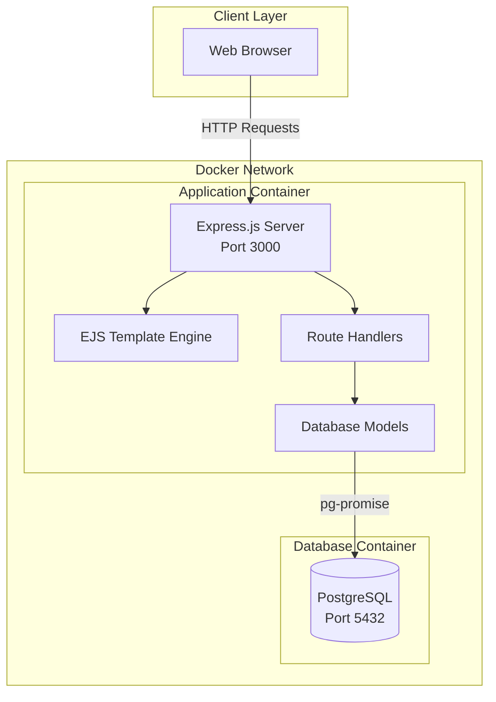
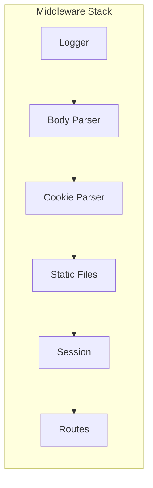
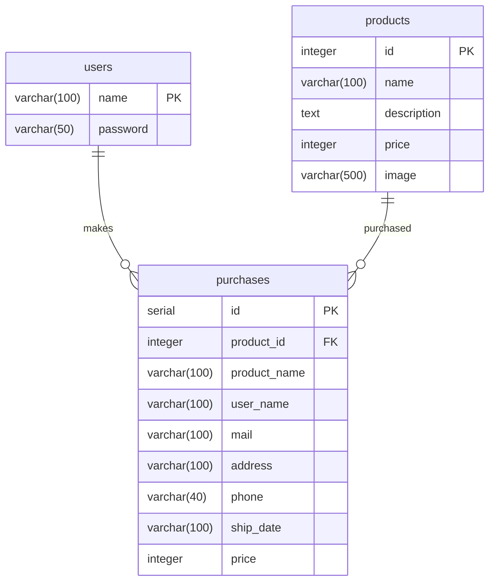
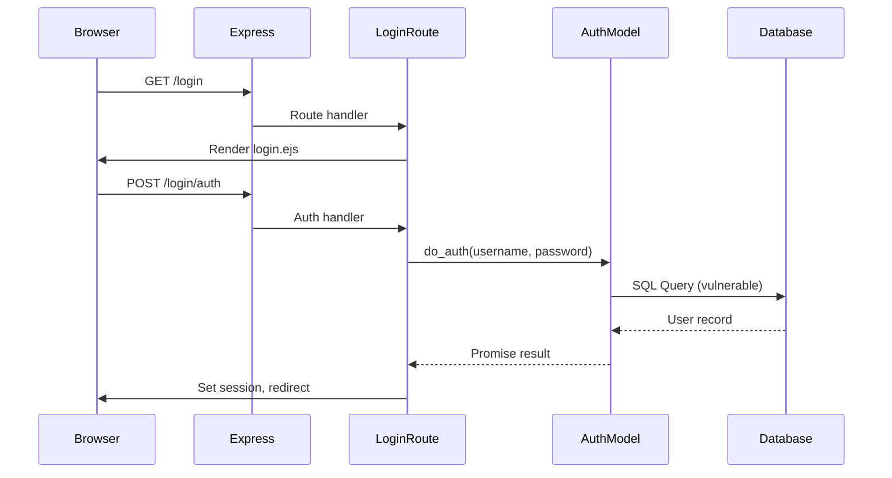
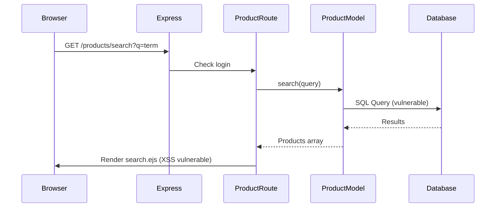

# Architecture Overview

## Table of Contents

- [Introduction](#introduction)
- [System Architecture](#system-architecture)
- [Application Components](#application-components)
- [Database Schema](#database-schema)
- [Request Flow](#request-flow)
- [Directory Structure](#directory-structure)
- [Technology Stack](#technology-stack)

## Introduction

This document provides a comprehensive overview of the vulnerable-node application architecture. Understanding the architecture helps security researchers identify potential attack vectors and understand the flow of data through the system.

> [!IMPORTANT]
> This application is intentionally vulnerable. The architecture decisions described here often represent anti-patterns that should be avoided in production systems.

## System Architecture

The application follows a traditional three-tier architecture deployed using Docker containers.



## Application Components

### Express.js Server

The main application entry point is `app.js`, which configures:

- Template engine (EJS with ejs-locals)
- Body parser middleware
- Cookie parser
- Session management
- Static file serving
- Route registration



### Route Handlers

The application has two main route modules:

| Route Module | File | Responsibility |
|--------------|------|----------------|
| Login Routes | `routes/login.js` | Authentication, login/logout |
| Product Routes | `routes/products.js` | Product listing, search, purchase |

### Database Models

Models handle database interactions using pg-promise:

| Model | File | Functions |
|-------|------|-----------|
| Auth | `model/auth.js` | User authentication |
| Products | `model/products.js` | Product CRUD operations |
| Init DB | `model/init_db.js` | Database initialization |

## Database Schema

The PostgreSQL database contains three tables:



### Table Definitions

#### Users Table

Stores user credentials in plain text (intentionally insecure).

```sql
CREATE TABLE users(
    name VARCHAR(100) PRIMARY KEY,
    password VARCHAR(50)
);
```

#### Products Table

Stores product catalog information.

```sql
CREATE TABLE products(
    id INTEGER PRIMARY KEY,
    name VARCHAR(100) NOT NULL,
    description TEXT NOT NULL,
    price INTEGER,
    image VARCHAR(500)
);
```

#### Purchases Table

Records customer purchase history.

```sql
CREATE TABLE purchases(
    id SERIAL PRIMARY KEY,
    product_id INTEGER NOT NULL,
    product_name VARCHAR(100) NOT NULL,
    user_name VARCHAR(100),
    mail VARCHAR(100) NOT NULL,
    address VARCHAR(100) NOT NULL,
    phone VARCHAR(40) NOT NULL,
    ship_date VARCHAR(100) NOT NULL,
    price INTEGER NOT NULL
);
```

## Request Flow

### Authentication Flow



### Product Search Flow



## Directory Structure

```
vulnerable-node/
├── app.js                 # Express application setup
├── config.js              # Database configuration
├── dummy.js               # Seed data for database
├── package.json           # Node.js dependencies
├── Dockerfile             # Application container
├── docker-compose.yml     # Multi-container orchestration
│
├── bin/
│   └── www                # Server startup script
│
├── model/
│   ├── auth.js            # Authentication model (SQL injection)
│   ├── init_db.js         # Database initialization
│   └── products.js        # Product model (SQL injection)
│
├── routes/
│   ├── login.js           # Login/logout routes
│   ├── login_check.js     # Authentication middleware
│   └── products.js        # Product routes
│
├── views/
│   ├── layout.ejs         # Base layout template
│   ├── content.ejs        # Content layout
│   ├── login.ejs          # Login page
│   ├── products.ejs       # Product listing
│   ├── product_detail.ejs # Product detail page
│   ├── search.ejs         # Search results (XSS)
│   ├── bought_products.ejs# Purchase history
│   └── error.ejs          # Error page
│
├── public/
│   ├── images/            # Product images
│   ├── javascripts/       # Client-side JS
│   └── stylesheets/       # CSS files
│
├── attacks/               # Attack demonstration scripts
│   ├── csrf/              # CSRF attack examples
│   ├── evil_regex/        # ReDoS attack examples
│   ├── sqli/              # SQL injection examples
│   └── log_injection.sh   # Log injection example
│
├── services/
│   └── postgresql/        # Database container setup
│       ├── Dockerfile
│       └── init.sql
│
└── docs/                  # Documentation
    ├── ARCHITECTURE.md    # This file
    ├── VULNERABILITIES.md # Vulnerability documentation
    └── ATTACKS.md         # Attack examples guide
```

## Technology Stack

| Component | Technology | Version | Purpose |
|-----------|------------|---------|---------|
| Runtime | Node.js | 19.3.0 | JavaScript runtime |
| Framework | Express.js | ~4.13.1 | Web framework |
| Template | EJS | ^2.4.2 | Server-side rendering |
| Database | PostgreSQL | Latest | Data persistence |
| DB Library | pg-promise | ^4.4.6 | Database client |
| Session | express-session | ^1.13.0 | Session management |
| Logging | log4js | ^0.6.36 | Application logging |
| Container | Docker | - | Deployment |
| Orchestration | Docker Compose | 3.9 | Multi-container setup |

> [!NOTE]
> The dependency versions are intentionally outdated to maintain known vulnerabilities for educational purposes.

## Related Documentation

- [Vulnerabilities Guide](./VULNERABILITIES.md) - Detailed vulnerability documentation
- [Attack Examples](./ATTACKS.md) - How to exploit the vulnerabilities
- [Contributing Guide](../CONTRIBUTING.md) - How to contribute to the project
