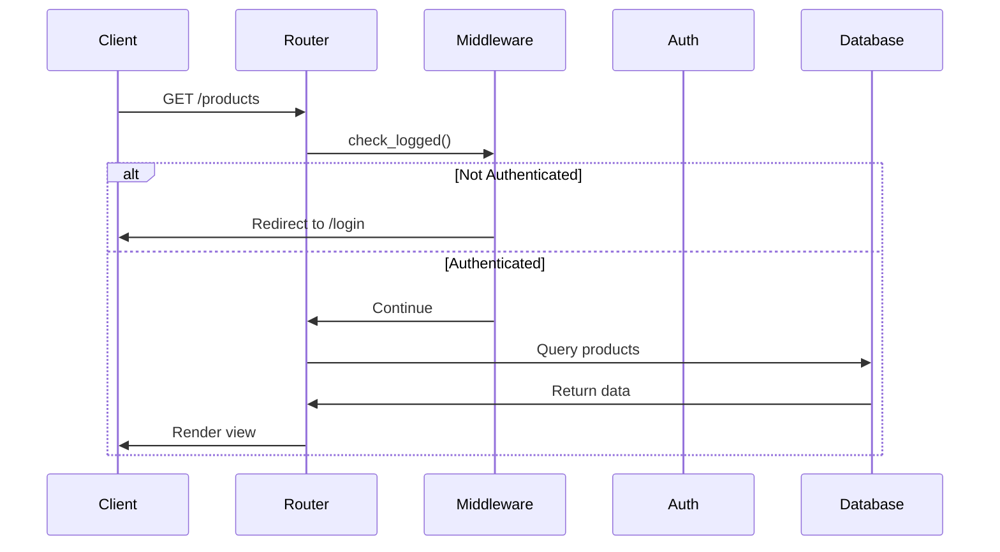
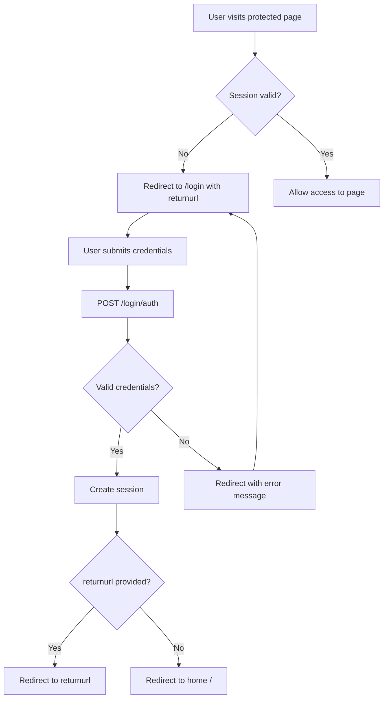

# Routes Module

This directory contains the HTTP route handlers for the Vulnerable Node application. These modules define the application's URL endpoints and handle incoming requests.

## Table of Contents

- [Overview](#overview)
- [Route Files](#route-files)
- [Request Flow](#request-flow)
- [Authentication Flow](#authentication-flow)
- [Common Vulnerabilities](#common-vulnerabilities)
- [Usage Examples](#usage-examples)

## Overview

The routes module implements the presentation layer of the application using Express.js routers. Each file handles a specific domain of functionality:

- **Authentication** - User login and session management
- **Products** - Product catalog and e-commerce operations
- **Session validation** - Middleware for protected routes

## Route Files

### login.js

**Purpose:** Handles user authentication and session management

**Endpoints:**

| Method | Path | Description | Authentication |
|--------|------|-------------|----------------|
| GET | `/login` | Display login form | None |
| POST | `/login/auth` | Process login credentials | None |
| GET | `/logout` | End user session | None |

**Key Vulnerabilities:**
- SQL Injection via `auth()` call
- Open Redirect via `returnurl` parameter
- XSS via unsanitized error messages
- Log Injection via username logging

**Example Usage:**
```bash
# Normal login
curl -X POST http://localhost:3000/login/auth \
  -d "username=admin&password=admin"

# SQL injection bypass
curl -X POST http://localhost:3000/login/auth \
  -d "username=admin'--&password=anything"
```

### products.js

**Purpose:** Product browsing, searching, and purchasing functionality

**Endpoints:**

| Method | Path | Description | Authentication |
|--------|------|-------------|----------------|
| GET | `/` | List all products | Required |
| GET | `/products/detail` | Show product details | Required |
| GET | `/products/search` | Search products | Required |
| GET | `/products/purchased` | View purchase history | Required |
| ALL | `/products/buy` | Purchase a product | Required |

**Key Vulnerabilities:**
- SQL Injection in search, detail, and purchase queries
- Price manipulation (client controls price)
- CSRF on purchase endpoint
- ReDoS in email validation
- Insecure Direct Object References

**Example Usage:**
```bash
# Search products (with SQL injection)
curl http://localhost:3000/products/search?q=wallet

# SQL injection in search
curl "http://localhost:3000/products/search?q='; DROP TABLE products; --"

# Purchase with manipulated price (CSRF + Price manipulation)
curl "http://localhost:3000/products/buy?product_id=1&product_name=Test&price=1€&mail=test@test.com&address=123 Main St&phone=555-1234&ship_date=2025-12-01"
```

### login_check.js

**Purpose:** Middleware for validating user authentication

**Functionality:**
- Checks if `req.session.logged` is true
- Redirects unauthenticated users to login page
- Preserves return URL for post-login redirect

**Key Vulnerability:**
- Open Redirect via unvalidated `req.url` in returnurl

**Usage:**
```javascript
// In other route files
var check_logged = require("./login_check");

router.get('/protected-route', function(req, res) {
    check_logged(req, res);  // Redirect to login if not authenticated
    // ... protected route logic
});
```

## Request Flow



## Authentication Flow



## Common Vulnerabilities

> [!WARNING]
> These are intentional vulnerabilities for security testing. Do not replicate these patterns in production code.

### SQL Injection

**Location:** All database queries in `products.js` and via `auth()` in `login.js`

**Problem:** User input directly concatenated into SQL queries

**Example:**
```javascript
// VULNERABLE CODE
var q = "SELECT * FROM products WHERE id = '" + product_id + "';";
```

**Secure Alternative:**
```javascript
// SECURE CODE (NOT in this project)
var q = "SELECT * FROM products WHERE id = $1";
db.one(q, [product_id]);
```

### Open Redirect

**Location:** `login.js`, `login_check.js`

**Problem:** `returnurl` parameter not validated

**Example Attack:**
```
http://localhost:3000/login?returnurl=http://evil.com/phishing
```

**Secure Alternative:**
```javascript
// Validate returnurl is internal
if (returnurl && returnurl.startsWith('/')) {
    res.redirect(returnurl);
} else {
    res.redirect('/');
}
```

### CSRF

**Location:** `/products/buy` endpoint

**Problem:** No CSRF token validation, accepts GET requests

**Example Attack:**
```html
<!-- Attacker's malicious page -->

```

**Secure Alternative:**
```javascript
// Use CSRF tokens
const csrf = require('csurf');
app.use(csrf());

// Only accept POST for state-changing operations
router.post('/products/buy', function(req, res) {
    // Validate CSRF token
    // Process purchase
});
```

### Price Manipulation

**Location:** `/products/buy` endpoint

**Problem:** Client submits the price, server doesn't verify

**Example Attack:**
```bash
# Buy expensive item for 1€
curl "http://localhost:3000/products/buy?product_id=1&price=1€&..."
```

**Secure Alternative:**
```javascript
// Look up actual price from database
db.one('SELECT price FROM products WHERE id = $1', [product_id])
    .then(function(product) {
        cart.price = product.price;  // Use verified price
        // Process purchase
    });
```

## Usage Examples

### Normal Product Browsing Flow

```javascript
// 1. User logs in
POST /login/auth
  username=admin
  password=admin

// 2. View product catalog
GET /

// 3. Search for products
GET /products/search?q=phone

// 4. View product details
GET /products/detail?id=5

// 5. Purchase product
POST /products/buy
  product_id=5
  product_name=Phone Fingers
  price=3€
  mail=user@example.com
  address=123 Main St
  phone=555-1234
  ship_date=2025-12-01

// 6. View purchase history
GET /products/purchased
```

### Attack Demonstration Flow

```javascript
// SQL Injection - Bypass authentication
POST /login/auth
  username=admin'--
  password=anything

// SQL Injection - View all purchases
GET /products/purchased
  (session.user_name = "' OR '1'='1")

// CSRF - Trick user into making purchase
GET /products/buy?product_id=1&price=1€&...

// Open Redirect - Phishing attack
GET /login?returnurl=http://evil.com/fake-login
```

## Related Documentation

- [Model Layer](../model/README.md) - Database operations and vulnerabilities
- [SECURITY.md](../SECURITY.md) - Comprehensive vulnerability documentation
- [Attack Examples](../attacks/README.md) - Exploitation demonstrations

---

> [!CAUTION]
> These routes contain intentional security vulnerabilities. Never use this code in production applications.
